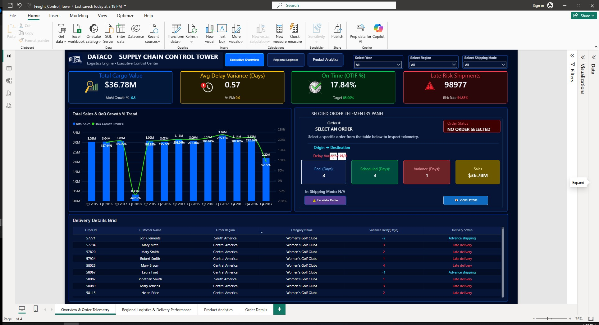
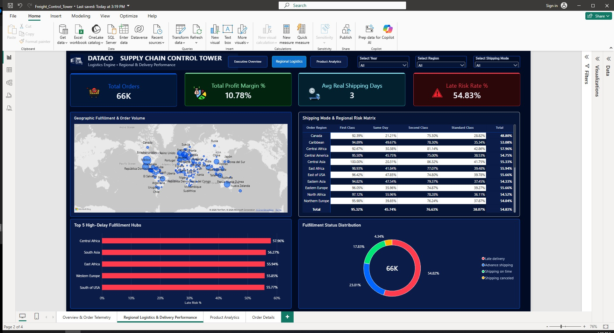
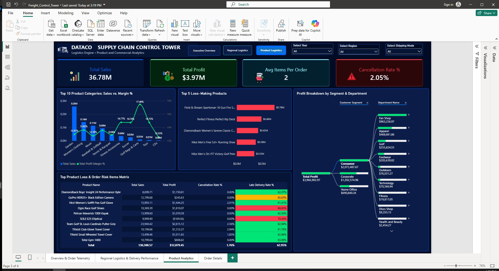

# DataCo Supply Chain Control Tower | Power BI Project

An executive-grade, multi-page **Supply Chain Control Tower** dashboard built in Power BI using the `DataCoSupplyChainDataset`. This interactive report provides end-to-end visibility across global logistics operations, shipping performance, revenue trends, and product-level risk analytics. Designed with a high-contrast executive dark theme (`#020B24` canvas / `#061536` visual cards), the dashboard balances high-level executive KPIs with granular operational telemetry.

---

## 📸 Executive Dashboards

### 1. Executive Overview & Order Telemetry


### 2. Regional Logistics & Delivery Performance


### 3. Product & Commercial Analytics


---

## 🎨 Theme & Color Palette

The report implements a custom 10-color dark UI design system optimized for executive scannability, status identification, and high contrast:

| Color Role | Hex Code | Visual Application |
| :--- | :--- | :--- |
| **Canvas Background** | `#020B24` | Overall page backdrop |
| **Card / Visual Fill** | `#061536` | KPI card containers, visual backgrounds, table headers |
| **Primary Accent** | `#0066FF` | Sales metrics, primary buttons, structural borders |
| **Success Indicator** | `#00C853` | On-Time delivery, profit growth, positive margin indicators |
| **Danger / High Risk** | `#FF3B4D` | Late shipments, cancellation rates, loss-making products |
| **Warning / Variance** | `#FFC400` | Delay variance indicators, shipping alerts |
| **Cyan Accent** | `#19E6FF` | Processing speeds, shipping day metrics |

---

## 🏗️ Architecture & Page Breakdown

### Page 1: Executive Overview & Order Telemetry
* **Global Navigation Header:** Synced year slicer, region slicer, shipping mode slicer, and a dynamic **Clear All Filters** bookmark button.
* **Status-Tinted KPI Row:** Highlights Total Cargo Value, Avg Delay Variance, On-Time (OTIF %), and Late Risk Shipments with dark status-tinted card backgrounds (`#031838`, `#241B03`, `#02240E`, `#2B070A`).
* **Sales & QoQ Growth Combo Chart:** Tracks quarterly total sales alongside custom QoQ trend growth percentages without relying on auto date hierarchies.
* **Selected Order Telemetry Panel:** Interactive panel displaying deep single-order metrics (Real vs Scheduled Days, Delay Variance, Order Status) upon selecting any row in the grid.
* **Cross-Filtered Order Grid:** Detailed cross-filtered order table linked directly to the telemetry panel and drillthrough navigation.

### Page 2: Regional Logistics & Delivery Performance
* **Regional Logistics KPIs:** Monitors Total Orders, Profit Margin %, Avg Real Shipping Days, and Late Risk Rate %.
* **Geographic Fulfillment Map:** Interactive map showing global shipping density, corridor volume, and delay hubs.
* **Shipping Mode & Regional Risk Matrix:** 100% stacked breakdown evaluating delivery status distributions across carriers and geographic regions.
* **Top 5 High-Delay Fulfillment Hubs:** Identifies bottleneck corridors with the highest percentage of shipping delays.

### Page 3: Product & Commercial Analytics
* **Commercial KPIs:** Tracks Total Sales, Total Profit, Avg Basket Items Per Order, and Cancellation Rate %.
* **Category Sales vs. Margin % Combo Chart:** Identifies high-volume product categories and evaluates their net margin contributions.
* **Top 5 Loss-Making Products:** Red-flag horizontal bar chart highlighting SKUs causing the largest profit drain.
* **Profit Breakdown Decomposition Tree:** Interactive root-cause tree analyzing net profit performance across Customer Segments and Product Departments.
* **Product Loss & Risk Table:** Conditional-formatted matrix highlighting cancellation and late delivery risk rates per product line.

### Utility Page: Order Details (Drillthrough)
* Dedicated high-density table view providing direct order audit trails.
* Configured with **`Order Id`** drillthrough target fields and automatic back-navigation buttons (`←`).

---

## 🧮 Key DAX Measures

### On-Time In-Full (OTIF %)
```dax
OTIF % = 
VAR OnTimeOrders = 
    CALCULATE (
        COUNT ( 'DataCoSupplyChainDataset'[Order Id] ),
        'DataCoSupplyChainDataset'[Delivery Status] = "Advance shipping"
            || 'DataCoSupplyChainDataset'[Delivery Status] = "Shipping on time"
    )
VAR TotalOrders = COUNT ( 'DataCoSupplyChainDataset'[Order Id] )
RETURN
    DIVIDE ( OnTimeOrders, TotalOrders, 0 )

### Late Risk Rate %

Late Risk Rate % = 
VAR LateOrders = 
    CALCULATE (
        COUNT ( 'DataCoSupplyChainDataset'[Order Id] ),
        'DataCoSupplyChainDataset'[Delivery Status] = "Late delivery"
    )
VAR TotalOrders = COUNT ( 'DataCoSupplyChainDataset'[Order Id] )
RETURN
    DIVIDE ( LateOrders, TotalOrders, 0 )

### QoQ Growth Trend %

QoQ Growth Trend % = 
VAR CurrentSales = [Total Sales]
VAR CurrentDate = MAX ( 'DataCoSupplyChainDataset'[order date (DateOrders)] )
VAR PreviousQuarterDate = EDATE ( CurrentDate, -3 )

VAR PreviousSales = 
    CALCULATE (
        [Total Sales],
        FILTER (
            ALLSELECTED ( 'DataCoSupplyChainDataset' ),
            MONTH ( 'DataCoSupplyChainDataset'[order date (DateOrders)] ) = MONTH ( PreviousQuarterDate )
                && YEAR ( 'DataCoSupplyChainDataset'[order date (DateOrders)] ) = YEAR ( PreviousQuarterDate )
        )
    )

RETURN
    IF (
        ISBLANK ( CurrentSales ) || ISBLANK ( PreviousSales ),
        BLANK (),
        DIVIDE ( CurrentSales - PreviousSales, PreviousSales )
    )

🚀 How to Run the Project
Clone or download this repository.

Open Microsoft Power BI Desktop.

Place DataCoSupplyChainDataset.csv in your project folder or update the data source path in Power Query.

Open the .pbix file.

Interact with synced slicers, custom bookmark reset buttons, and drillthrough order navigation.
